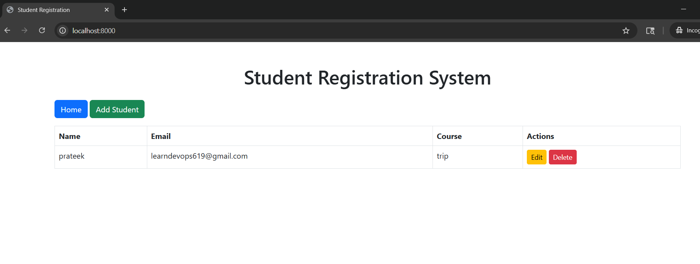
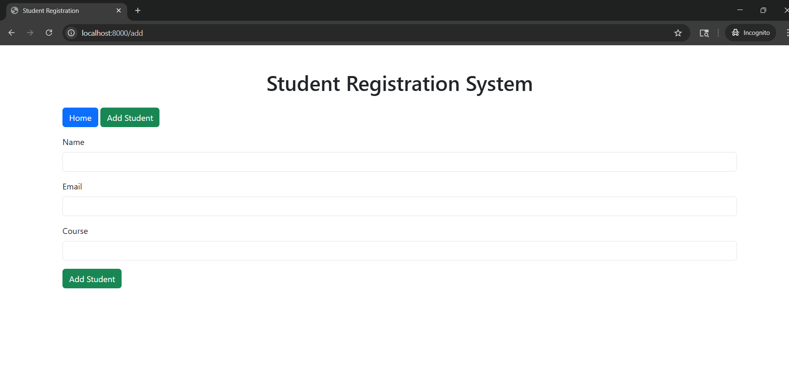
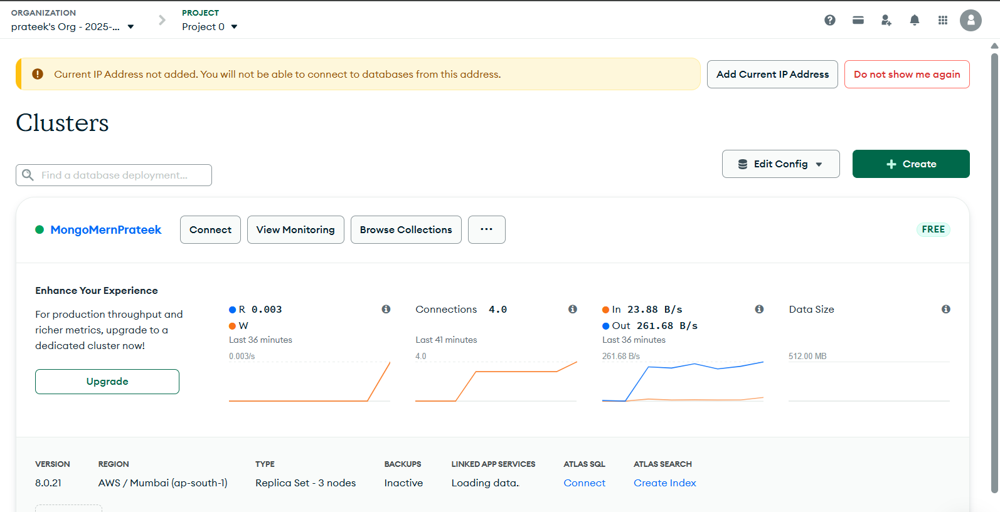
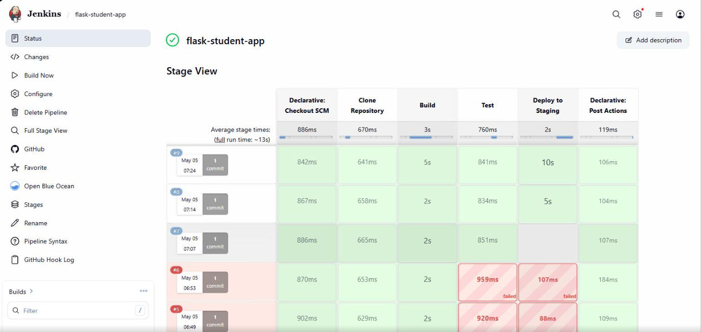
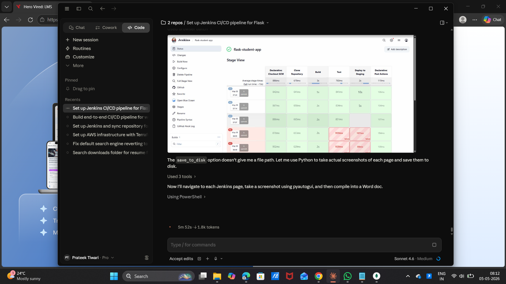

# Student Registration System

A simple **Flask** web application to manage student records with **MongoDB Atlas** as the backend database. Users can **add, view, update, and delete** student details.

---

## Features

* List all students on the home page
* Add a new student
* Update existing student details
* Delete a student with confirmation
* Simple and responsive UI using Bootstrap
* Fully automated CI/CD pipeline via Jenkins

---

## Tech Stack

* **Backend:** Python, Flask
* **Database:** MongoDB Atlas (via Flask-PyMongo)
* **Frontend:** HTML, Jinja2 templates, Bootstrap 5
* **Environment Variables:** Managed via `.env` file
* **CI/CD:** Jenkins Pipeline

---

## Screenshots

### Home Page
Lists all students with Edit/Delete buttons.



### Add Student
Form to add a new student.



---

## Setup Instructions

### 1. Clone the repository

```bash
git clone https://github.com/Prateekdevops-619/flask_Practice.git
cd flask_Practice
```

### 2. Create and activate a virtual environment

```bash
python -m venv venv
# Windows:
venv\Scripts\activate
# Linux / Mac:
source venv/bin/activate
```

### 3. Install dependencies

```bash
pip install -r requirements.txt
```

### 4. Configure environment variables

Create a `.env` file in the project root:

```
MONGO_URI=mongodb+srv://<username>:<password>@<cluster>.mongodb.net/students?retryWrites=true&w=majority
SECRET_KEY=<your-secret-key>
```

### 5. Run the application

```bash
python app.py
```

Open your browser at: [http://localhost:8000](http://localhost:8000)

### 6. Run tests

```bash
pip install pytest
python -m pytest test_app.py -v
```

---

## Project Structure

```
flask_Practice/
├── screenshots/
│   ├── app_home.png
│   ├── app_add_student.png
│   ├── jenkins_stage_view.png
│   ├── jenkins_build_success.png
│   ├── jenkins_tests_passed.png
│   ├── jenkins_finished.png
│   └── mongodb_atlas.png
├── templates/
│   ├── base.html
│   ├── index.html
│   ├── add_student.html
│   └── update_student.html
├── app.py
├── test_app.py
├── requirements.txt
├── Jenkinsfile
├── .env
└── README.md
```

---

## MongoDB Atlas

The application uses **MongoDB Atlas** (free M0 cluster) as the cloud database backend.



> Cluster: **MongoMernPrateek** | Region: AWS / Mumbai (ap-south-1) | Active connections: 4

---

## Jenkins CI/CD Pipeline

### Overview

This project includes a fully automated Jenkins CI/CD pipeline defined in the [`Jenkinsfile`](https://github.com/Prateekdevops-619/flask_Practice/blob/main/Jenkinsfile). The pipeline automates building, testing, and deploying the Flask application.

### Pipeline Stages

| Stage | Description |
|-------|-------------|
| **Clone Repository** | Checks out the latest code from the `main` branch on GitHub |
| **Build** | Installs all dependencies from `requirements.txt` using pip3 |
| **Test** | Runs the unit test suite using pytest (6 tests) |
| **Deploy to Staging** | Deploys the Flask application to the staging environment |

### Pipeline Stage View

All stages passing successfully across multiple builds:



### Build #9 — Successful Execution




### Pipeline Flow

```
Push to main → Clone → Build (pip install) → Test (pytest) → Deploy to Staging
                                                  ↓
                                        Post: Success/Failure message
```

### Prerequisites

Before setting up the Jenkins pipeline, ensure the following:

1. **Jenkins Server**: Access to Jenkins at [https://jenkinsacademics.herovired.com/](https://jenkinsacademics.herovired.com/)
2. **Python 3.x** installed on the Jenkins agent
3. **pip** package manager available
4. **Git** installed on the Jenkins agent
5. **MongoDB Atlas** cluster accessible from the Jenkins environment

### Jenkins Setup Steps

#### Step 1: Create the Pipeline Job

1. Click **New Item** in Jenkins
2. Enter a name (e.g., `flask-student-app`)
3. Select **Pipeline** and click OK
4. Under **Pipeline**, choose:
   - **Definition**: Pipeline script from SCM
   - **SCM**: Git
   - **Repository URL**: `https://github.com/Prateekdevops-619/flask_Practice.git`
   - **Branch Specifier**: `*/main`
   - **Script Path**: `Jenkinsfile`
5. Under **Build Triggers**, enable: **GitHub hook trigger for GITScm polling**
6. Click **Save**

#### Step 2: Configure GitHub Webhook (Auto-Trigger)

1. Go to your GitHub repository → **Settings → Webhooks → Add webhook**
2. Set:
   - **Payload URL**: `https://jenkinsacademics.herovired.com/github-webhook/`
   - **Content type**: `application/json`
   - **Events**: Select "Just the push event"
3. Click **Add webhook**

This enables automatic builds whenever code is pushed to the `main` branch.

### Notifications

The pipeline prints notifications on:

- **Build Success**: `Pipeline succeeded! Build #N completed successfully.`
- **Build Failure**: `Pipeline failed! Build #N failed. Check console output.`

---

## License

MIT License
